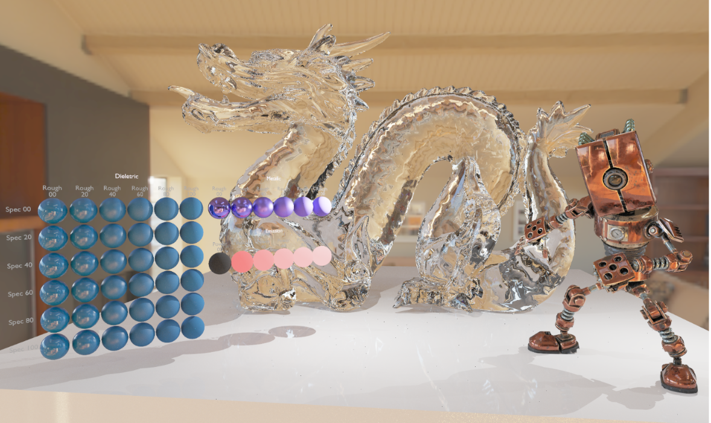
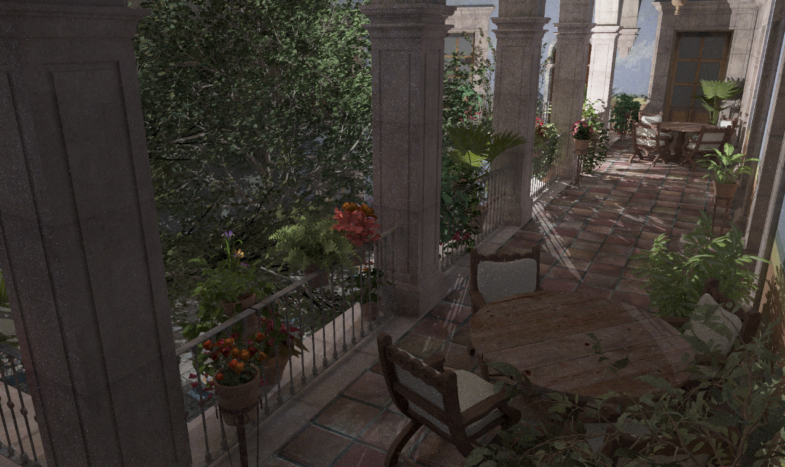



<pre>
 ███████████     █████████   ██████████   █████  █████████ 
▒▒███▒▒▒▒▒███   ███▒▒▒▒▒███ ▒▒███▒▒▒▒███ ▒▒███  ███▒▒▒▒▒███
 ▒███    ▒███  ▒███    ▒███  ▒███   ▒▒███ ▒███ ▒███    ▒▒▒ 
 ▒██████████   ▒███████████  ▒███    ▒███ ▒███ ▒▒█████████ 
 ▒███▒▒▒▒▒███  ▒███▒▒▒▒▒███  ▒███    ▒███ ▒███  ▒▒▒▒▒▒▒▒███
 ▒███    ▒███  ▒███    ▒███  ▒███    ███  ▒███  ███    ▒███
 █████   █████ █████   █████ ██████████   █████▒▒█████████ 
▒▒▒▒▒   ▒▒▒▒▒ ▒▒▒▒▒   ▒▒▒▒▒ ▒▒▒▒▒▒▒▒▒▒   ▒▒▒▒▒  ▒▒▒▒▒▒▒▒▒
</pre>

# Radis Engine

A modern, cross-platform game engine

---

## Features

### Rendering
- Forward, Deferred, and Hardware Raytracing modes.
- Physically Based Rendering (PBR), GGX/Schlick-GGX BRDF with metallic-roughness workflow.
- Real-time raycasting and pathtracing with Vulkan RTX acceleration structures.
- Custom render graph to automate resource transitions and barrier management alongside dynamic rendering (VK_KHR_dynamic_rendering).
- Skeletal animations are supported and work with most common model formats.

### Asset Pipeline
- All model types supported through Assimp can be loaded, and are converted to highly optimized formats for loading and rendering.
- All meshes are batched into a single vertex/index buffer for efficient rendering.
- Textures are highly compressed into the etc1s format with KTX2, and transcoded to the optimal GPU-compressed format on runtime such as BC7.
- Texture loading is fully parallelized for the fastest loading times.

### Networking (Experimental)
- Client-server architecture for multiplayer prototyping with ENet.
- In-editor chat window.

---

## System Requirements

| Component | Minimum | Recommended |
|-----------|---------|-------------|
| **OS** | Windows 10 | Windows 11 |
| **CPU** | Any x64 processor | Multi-core recommended |
| **GPU** | Vulkan 1.2 | RTX 2060+ for raytracing |
| **RAM** | 8 GB | 16 GB |

---

## Getting Started

### Prerequisites
- [Visual Studio 2026](https://visualstudio.microsoft.com/) with C++23 support
- Windows SDK 10.0+

### Building

1. Clone the repository
2. Open Radis.sln in Visual Studio, 
3. Build and run

---

## Camera Controls

| Action | Input |
|--------|-------|
| **Look Around** | Right Mouse + Drag |
| **Move** | W / A / S / D / E / Q |

---

## Dependencies

| Library | Purpose |
|---------|---------|
| [Vulkan SDK](https://vulkan.lunarg.com/) | Graphics API |
| [Volk](https://github.com/zeux/volk) | Vulkan function loader |
| [VMA](https://github.com/GPUOpen-LibrariesAndSDKs/VulkanMemoryAllocator) | Vulkan memory allocation |
| [GLFW](https://www.glfw.org/) | Window & input |
| [GLEW](https://glew.sourceforge.net/) | OpenGL extension loading |
| [GLM](https://github.com/g-truc/glm) | Math library |
| [EnTT](https://github.com/skypjack/entt) | ECS framework |
| [Assimp](https://github.com/assimp/assimp) | Model importing |
| [stb_image](https://github.com/nothings/stb) | Image loading |
| [Dear ImGui](https://github.com/ocornut/imgui) | Editor UI |
| [ImGuizmo](https://github.com/CedricGuillemet/ImGuizmo) | 3D gizmos |
| [nlohmann/json](https://github.com/nlohmann/json) | JSON parsing |
| [ENet](http://enet.bespin.org/) | Networking |
| [reflect-cpp](https://github.com/getml/reflect-cpp) | Compile-time reflection |

---

## Showcase

---

## License

This project is licensed under the **MIT License** — see the [LICENSE](LICENSE) file for details.

---

  Built with ❤️ by <a href="https://github.com/AdiPrk">Aditya Prakash</a>

